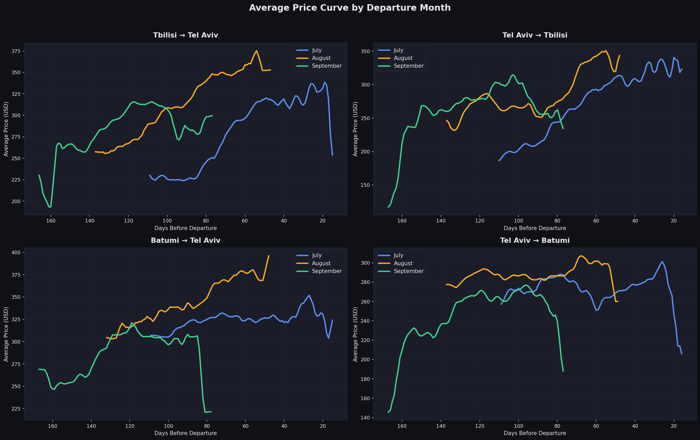

# Скрипты для сбора данных о ценах на авиабилеты

Этот репозиторий содержит автоматизированные инструменты, предназначенные для извлечения и визуализации данных о ценах на авиабилеты в реальном времени и исторических данных из крупных агрегаторов (Kayak и Google Flights).

Работая как распределенная сеть скрытых браузеров, эти инструменты позволяют нам непрерывно отслеживать изменения цен конкурентов и создавать собственный набор данных о рыночных ценах без блокировки со стороны систем защиты от ботов.

---

## Скрипты сбора данных (Скрейперы)

**Зачем нам нужны два разных скрейпера?**
Причина, по которой нам нужно 2 скрейпера, заключается в том, что Google Flights API (SearchAPI) не показывает все доступные рейсы для этих маршрутов, а значит, упускает значительную часть предложений на рынке. Однако для тех рейсов, которые он *показывает*, он предоставляет критически важные кривые исторических цен. С другой стороны, Kayak показывает почти все доступные на сегодняшний день рейсы на рынке, но не имеет контекста исторического ценообразования. Объединяя их, мы получаем как полный охват рынка, так и исторические базовые показатели.

Система опирается на два различных скрипта для сбора данных и визуализатор аналитики, каждый из которых служит своей конкретной цели:

### 1. Скрейпер Kayak (`kayak_scraper.py`)
**Цель:** Сбор актуальных цен на билеты в реальном времени и информации о наличии рейсов напрямую из результатов поиска Kayak.

**Как это работает:**
Kayak очень агрессивно блокирует автоматизированных ботов. Чтобы обойти это, мы используем сервис под названием **ScrapingBee**. ScrapingBee направляет наши запросы через сети резидентных прокси и рендерит страницу в реальном скрытом экземпляре браузера Chrome.
Скрипт выполняет следующее:
1. Он перебирает заданные нами маршруты (например, TBS - TLV, TLV - TBS).
2. Он одновременно открывает 4 сеанса браузера с использованием `ThreadPoolExecutor`. Такое распараллеливание сокращает время сбора данных с 6 часов до ~1,5 часов.
3. Он обходит баннеры с файлами cookie, дожидается полной загрузки результатов поиска авиабилетов с помощью JavaScript и перехватывает скрытые полезные нагрузки JSON, содержащие данные о ценах.
4. Он нормализует и сохраняет извлеченные данные в структурированном формате CSV.

### 2. Скрейпер Google Flights (`flight_tracker_searchapi.py`)
**Цель:** Извлечение кривых исторических цен и "Аналитики цен" (Price Insights) из Google Flights.

**Как это работает:**
В то время как Kayak сообщает нам цену *сегодня*, Google Flights обладает уникальной функцией, которая показывает, является ли цена "Обычной" (Typical), "Низкой" (Low) или "Высокой" (High), основываясь на исторических средних значениях.
1. Этот скрипт использует сервис **SearchAPI**, который предоставляет специальную конечную точку для чистого взаимодействия с Google Flights.
2. Он извлекает модуль "Price Insights" из Google Flights, предоставляя нам важнейшие исторические ориентиры и точно определяя, где находятся текущие цены по отношению к среднему рыночному показателю за последние 90 дней.

### 3. Визуализатор аналитики цен (`plot_price_history_v2.py`)
**Цель:** Преобразование необработанных данных о ценах в формате CSV в понятные аналитические графики и визуализации.

**Как это работает:**
Необработанные собранные данные трудно интерпретировать. Этот скрипт читает сгенерированные наборы данных CSV и создает визуальные отчеты высокого разрешения:
1. Он отображает кривую бронирования, показывая, как именно цены растут или падают по мере приближения даты вылета.
2. Он генерирует тепловые карты (heatmaps), определяющие самые дешевые окна для бронирования, и выделяет периоды экстремальной волатильности цен.
3. Графики выводятся непосредственно в виде PNG-файлов в специальные папки аналитики.

*Пример вывода:*


---

## Настройка и Установка

### 1. Требования
Убедитесь, что у вас установлен Python 3. Установите необходимые зависимости:
```bash
pip install pandas requests beautifulsoup4 matplotlib
```

### 2. Переменные окружения (API Ключи)
Поскольку эти скрипты полагаются на сторонние сервисы проксирования и рендеринга, чтобы избежать бана, вы должны экспортировать свои API ключи перед их запуском:

```bash
# Требуется для kayak_scraper.py
export SCRAPINGBEE_API_KEY="ваш_ключ_scrapingbee"

# Требуется для flight_tracker_searchapi.py
export SEARCHAPI_API_KEY="ваш_ключ_searchapi"
```
*(Свяжитесь с администратором, если у вас нет доступа к этим ключам).*

---

## Как использовать Скрейперы

### Запуск Скрейпера Kayak
Чтобы собрать ежедневные данные о ценах в реальном времени по всем маршрутам, просто запустите:
```bash
python3 kayak_scraper.py
```
*   **Чего ожидать:** Скрипт будет выводить свой прогресс в терминал. В процессе работы он создает временные файлы CSV для каждого маршрута (например, `_temp_TBS_TLV.csv`). Как только все 4 параллельных потока завершаются, он объединяет их в итоговый выходной файл (например, `combined_q3_2026_flights.csv`) и автоматически удаляет временные файлы.

### Запуск Скрейпера Google Flights
Чтобы собрать историческую аналитику цен, запустите:
```bash
python3 flight_tracker_searchapi.py
```
*   **Чего ожидать:** Этот скрипт работает намного быстрее, поскольку опирается на готовый API, а не на рендеринг полных сеансов браузера. Он выведет обогащенный набор данных (например, `q3_2026_pricing_data_searchapi_enriched.csv`), содержащий метрики исторической аналитики.

### Генерация аналитических графиков
Чтобы преобразовать собранные CSV-данные в визуальные графики, запустите:
```bash
python3 plot_price_history_v2.py
```
*   **Чего ожидать:** Скрипт обработает последние данные CSV и создаст серию графиков `.png` в каталоге `price_history_charts_v2/`, иллюстрирующих ценовые диапазоны, тепловые карты окон бронирования и сравнения маршрутов.

---

## Конфигурация: Изменение Маршрутов и Дат

Если вы хотите отслеживать другие направления или изменить период времени сбора данных, вам нужно будет отредактировать файлы Python напрямую.

### Изменение Направлений
Как в `kayak_scraper.py`, так и в `flight_tracker_searchapi.py` найдите список `ROUTES` в верхней части файла:
```python
ROUTES = [
    ("TBS", "TLV"),
    ("TLV", "TBS"),
    # Добавьте сюда новые маршруты, используя их коды IATA:
    ("JFK", "LHR"), 
]
```

### Изменение Дат Сбора Данных
В настоящее время скрейперы настроены на сбор данных о рейсах за 92-дневный период, начиная с 1 июля 2026 года.

**Чтобы изменить это в `kayak_scraper.py`:**
Найдите эти константы примерно на 88 строке:
```python
Q3_2026_START = datetime.date(2026, 7, 1)     # Установите вашу начальную дату здесь
Q3_2026_DAYS  = 92                            # Количество дней для сбора данных вперед
```

**Чтобы изменить это в `flight_tracker_searchapi.py`:**
Загляните внутрь функции `main()` примерно на 324 строке:
```python
    q3_start = datetime.date(2026, 7, 1)      # Установите вашу начальную дату здесь
    target_dates = [
        (q3_start + datetime.timedelta(days=i)).isoformat()
        for i in range(92)                    # Количество дней для сбора данных вперед
    ]
```

### Изменение Источника Данных для Визуализатора
По умолчанию визуализатор аналитики (`plot_price_history_v2.py`) ищет определенное имя файла CSV для создания графиков. Если вы хотите построить графики данных из скрейпера Kayak или скрейпера SearchAPI, вам нужно указать скрипту правильный выходной файл.

Откройте `plot_price_history_v2.py` и измените переменную `CSV_PATH` примерно на 26 строке:
```python
# Измените это, чтобы указать на ваш конкретный файл с собранными данными:
# Пример: "combined_q3_2026_flights.csv" (из Kayak)
# Пример: "q3_2026_pricing_data_searchapi_enriched.csv" (из Google)
CSV_PATH   = "price_history_q3_2026.csv"
```

---

## Важные Замечания по Хранению Данных
Эти скрипты генерируют большие объемы данных CSV. Чтобы репозиторий кода оставался чистым и быстрым, **все файлы `.csv` явно исключены через `.gitignore`**.

Сгенерированные файлы данных останутся на вашем локальном компьютере, но они не будут загружены или синхронизированы с GitHub. Если вам нужно поделиться необработанными наборами данных, сделайте это через безопасное облачное хранилище или ваше внутреннее хранилище данных.
